# Highly Configurable 6T SRAM Write Assist with Sense-Amplifier Input Offset Compensation

## Project Overview

This project focuses on improving the reliability of a conventional **6T SRAM cell** under reduced supply voltage operation using circuit-level assist techniques implemented in **Cadence Virtuoso** in 45 nm technology node.

As CMOS technology scales, SRAM cells become harder to write and more difficult to sense correctly at low voltage. To address these issues, this work implements:

- **Negative Bitline (NBL) Write Assist**
- **Column VDD Collapse Write Assist**
- **Combined NBL + VDD Collapse Assist**
- **Latch-Type Sense Amplifier with Capacitor-Based Offset Compensation**

Simulation results demonstrate faster write transitions, improved low-voltage operating margin, and reliable sensing of small bitline differentials.

---

## Why This Project Matters

SRAM occupies a major portion of modern processors, caches, and SoCs. Lowering supply voltage reduces power, but it also creates two major problems:

### Write Difficulty
The access transistor must overpower the internal inverter to flip the stored data.

### Read Difficulty
Only a very small voltage difference appears on BL and BLB, making sensing vulnerable to mismatch and noise.

This project explores practical solutions widely used in industry SRAM macros.

---

# Conventional 6T SRAM Cell

The standard 6T SRAM cell uses:

- Two cross-coupled CMOS inverters  
- Two access transistors  
- Differential bitlines BL / BLB  
- Wordline controlled access

It offers excellent density and speed, but low-voltage robustness becomes challenging.

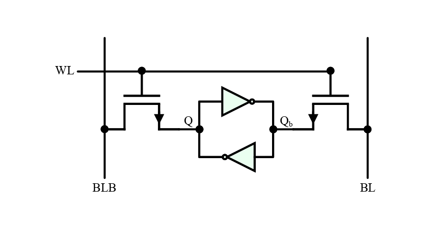

---

# Write Assist Circuit Implementation

A configurable assist architecture was designed where multiple assist methods can be enabled independently or together depending on voltage and timing needs.

Supported modes:

- Normal write  
- Negative Bitline assist  
- Column VDD collapse  
- Combined assist mode

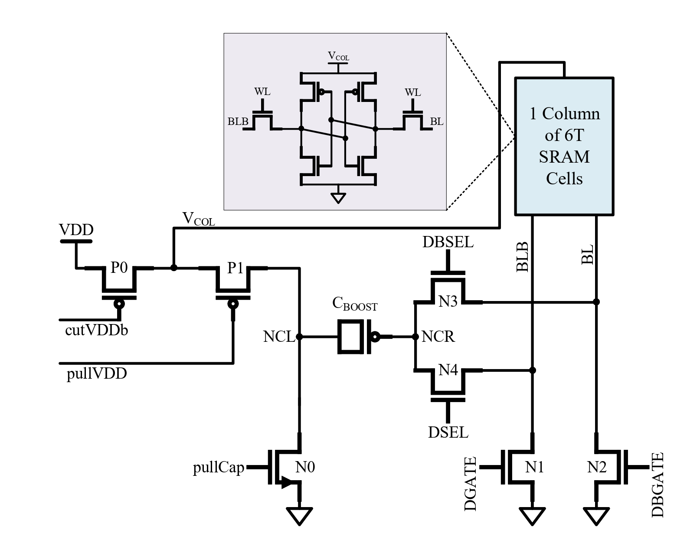

---

# Write Assist Simulation Testbench

Transient simulations were performed in Cadence Virtuoso using a complete SRAM write environment including:

- Bitcell  
- Write drivers  
- Assist control signals  
- Wordline timing  
- Internal node probes

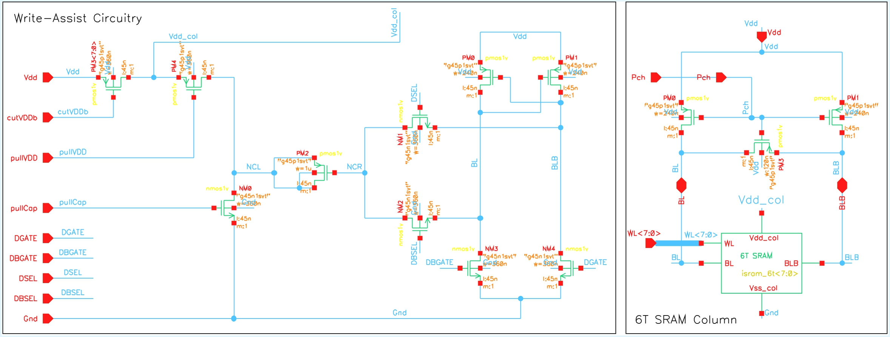

---

# Negative Bitline Assist

The selected write bitline is driven slightly below ground for a short duration.

### Benefit

- Increases access transistor overdrive
- Strengthens discharge path
- Improves write speed

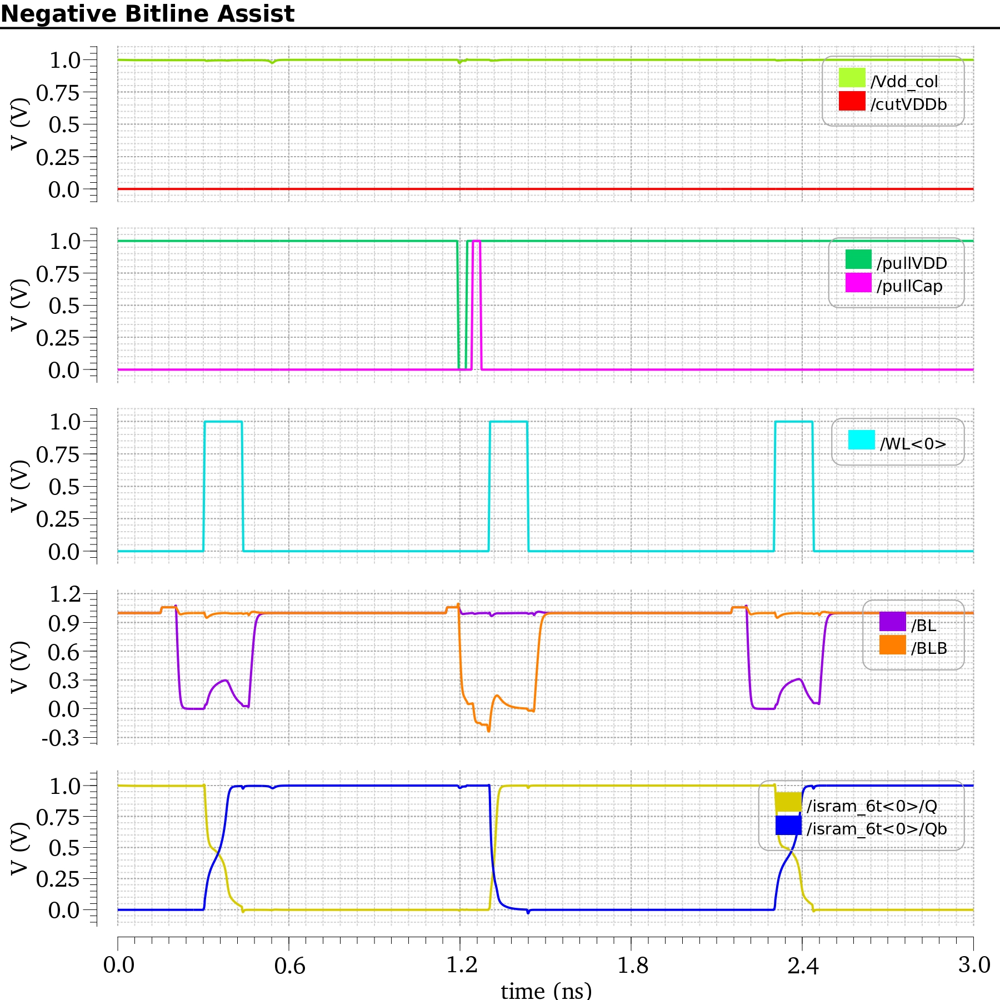

---

# Negative Bitline + VDD Collapse Assist

This mode combines:

- Negative bitline pulse  
- Temporary reduction of local column supply

### Benefit

- Access transistor becomes stronger  
- Internal PMOS pull-up becomes weaker  
- Fastest node inversion achieved

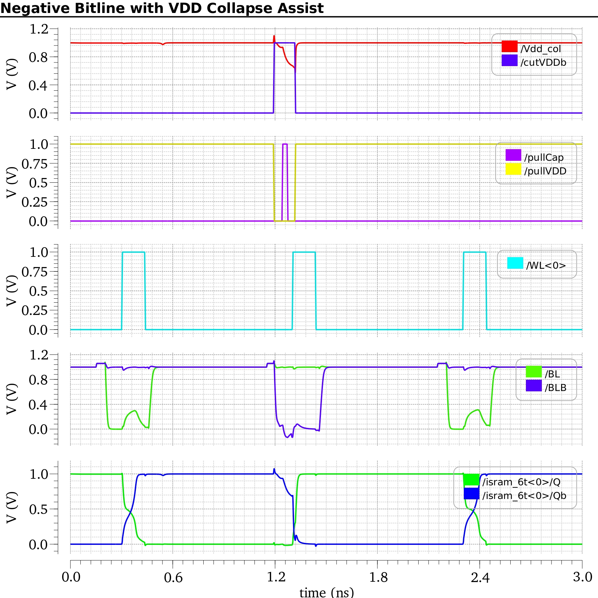

---

# Write Time Comparison

Write time was measured from **50% WL rising edge** to **50% switching point of internal storage node**.

| Technique | Write Time |
|----------|------------|
| No Assist | 57 ps |
| Negative Bitline Assist | 21 ps |
| NBL + VDD Collapse | 12 ps |

### Observation

The combined assist mode provides the fastest write operation and strongest writeability improvement.

---

# Sense Amplifier Circuit Diagram

A latch-type differential sense amplifier with capacitor-based offset compensation was implemented to reliably detect small BL/BLB voltage differences.

### Purpose

- Reduce mismatch-induced offset  
- Improve low-voltage sensing  
- Regenerate full swing outputs quickly

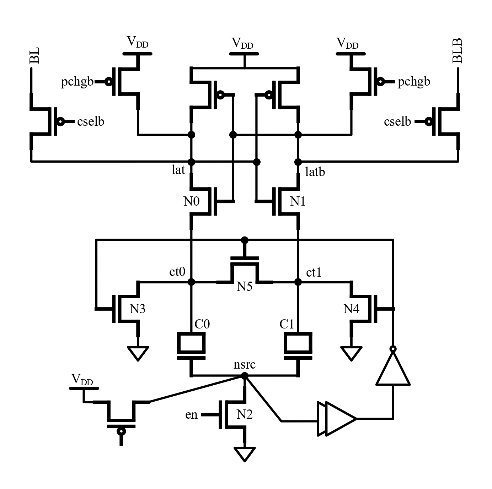

---

# Sense Amplifier Virtuoso Schematic

Full transistor-level implementation in Cadence Virtuoso including:

- Precharge network  
- Differential latch  
- Compensation capacitors  
- Output regeneration stage

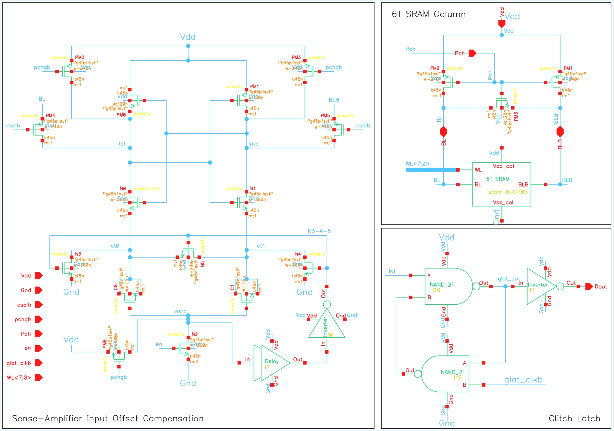

---

# Sense Amplifier Waveforms

Simulation confirms correct sensing of small bitline differentials and stable output regeneration.

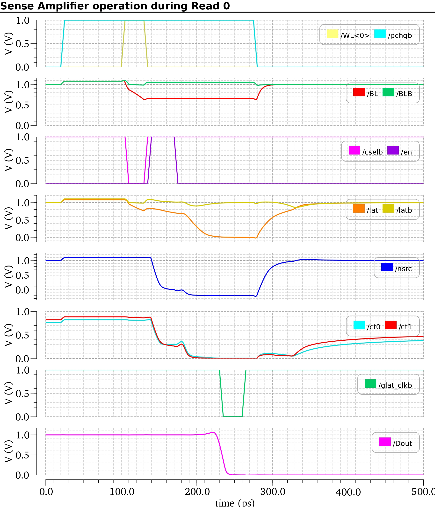

---

# Shmoo Plot Results

Shmoo plots were generated to evaluate functionality across operating conditions.

### Color Meaning

- 🟩 Green = Successful Write  
- 🟥 Red = Write Failure

These plots visually show how assist methods improve operating margin.

---

## 1. Baseline SRAM Write Operation

Without assist, successful writes require larger pulse width or higher supply voltage.

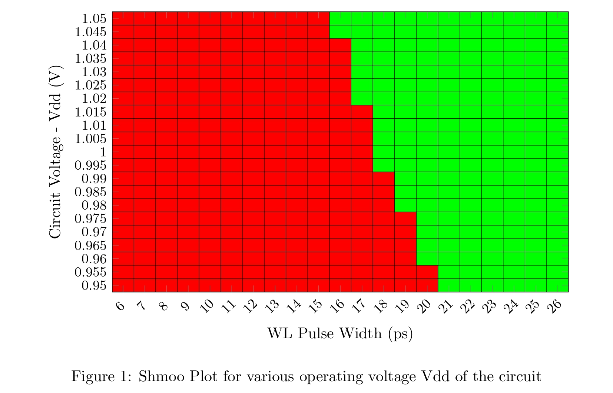

---

## 2. Negative Bitline Write Assist

NBL expands the working region significantly and reduces failure at lower pulse widths.

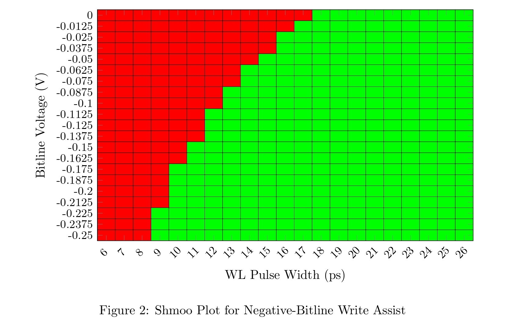

---

## 3. Column VDD Collapse Write Assist

Reducing local supply weakens internal pull-up devices and improves writeability.

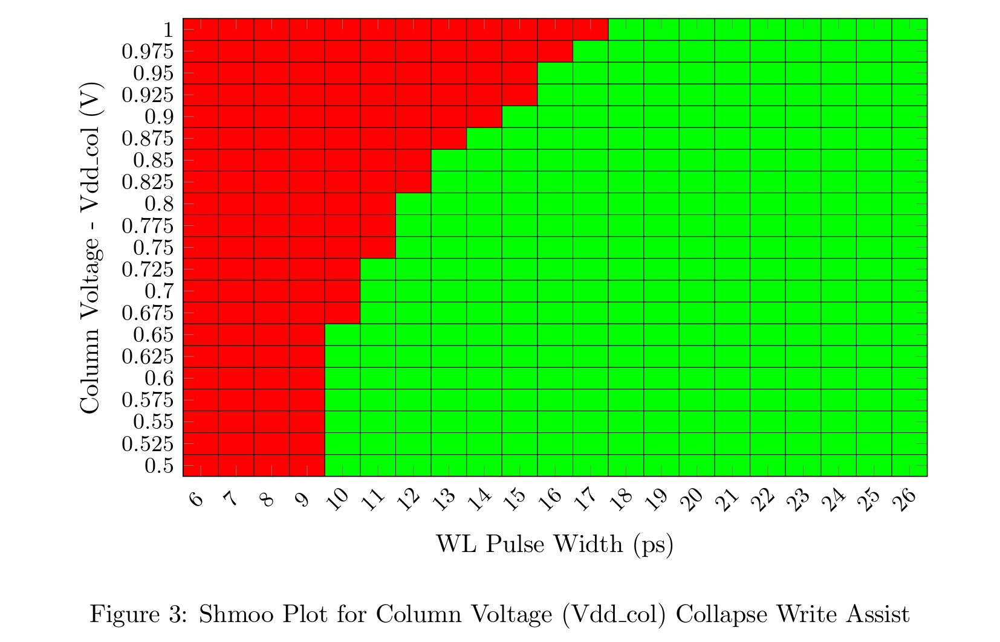

---

## 4. Combined Negative Bitline + VDD Collapse Assist

This provides the best margin and broadest successful operating region.

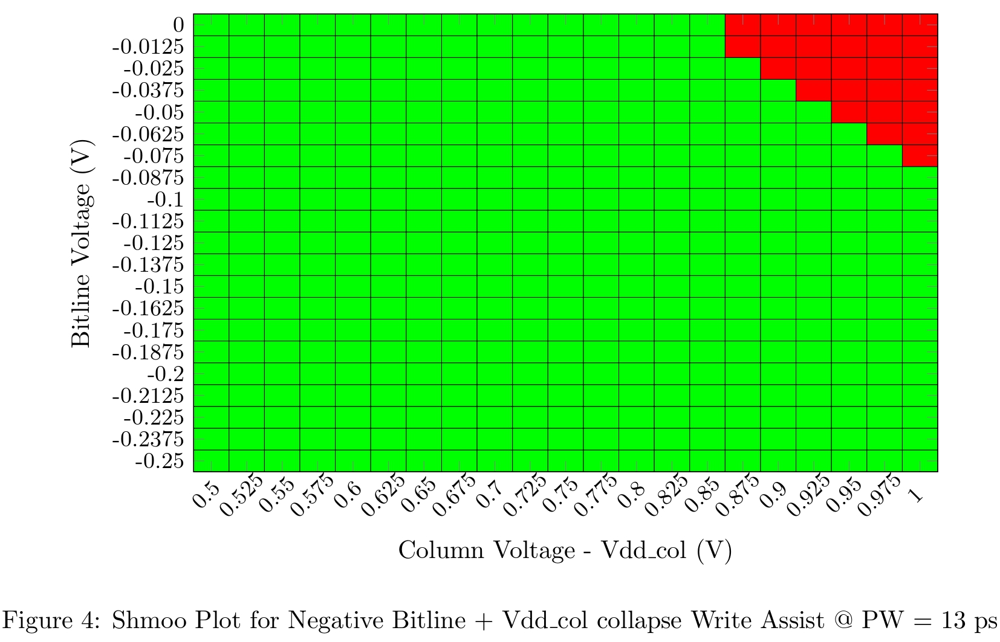

---

# Final Result Summary

| Technique | Write Delay | Write Margin | Low Voltage Capability |
|----------|-------------|-------------|------------------------|
| No Assist | Highest | Lowest | Limited |
| NBL Assist | Lower | Improved | Better |
| NBL + VDD Collapse | Lowest | Highest | Best |

---

# Tools Used

- Cadence Virtuoso  
- Spectre Simulator  
- ADE Explorer  
- Parametric Sweeps  
- Transient Analysis  

---

# Key Learning Outcomes

- SRAM bitcell operation  
- Low-voltage write assist techniques  
- Sense amplifier design  
- Timing analysis  
- Shmoo plot generation  
- Full custom circuit simulation  

---

# Full Project Report

📄 [Project_Report_AVD.pdf](Project_Report_AVD.pdf)

# Contributors
- [Vishal Kevat](https://github.com/vishalkevat007)  
- [Johan Cheriyan](https://github.com/vishalkevat007)  